  

 

## Profile

Final-year Computer Engineering student at Universidade Zambeze (UNIZA), Beira, Mozambique, completing a monograph on Txeneza, a georeferenced solid waste mapping platform built with Flutter, Next.js, Supabase and the Gemini API. Experienced in mobile and web development, applied AI integration, and spatial data systems, with a focus on offline-first architecture and production-grade engineering practices.

 

## Current Focus

| Area | Details |
|---|---|
| Primary Project | Txeneza — mobile and web platform for smart waste management |
| Stack | Flutter, Next.js, Supabase, PostGIS, Mapbox GL, Gemini API |
| Key Results | 97.5% image classification accuracy, 95% offline sync success rate |
| Academic | Final-year monograph defense, Computer Engineering, UNIZA |

 

## Technical Skills

**Languages**
 

**Frameworks and Platforms**
 

**Tools and Infrastructure**
 

 

## GitHub Statistics

Estes cartões são gerados diretamente no teu repositório por uma GitHub Action (ver <code>readme-stats.yml</code> em anexo), em vez de dependerem de um serviço público externo — mais estável e mais rápido a carregar.

 

## Contribution Activity

 

 

## Contribution Snake

Este componente anima-se sozinho a cada contribuição, através de uma GitHub Action que corre automaticamente (ver ficheiro <code>snake.yml</code> em anexo). Basta adicioná-la ao repositório uma única vez.

 

## Contact

